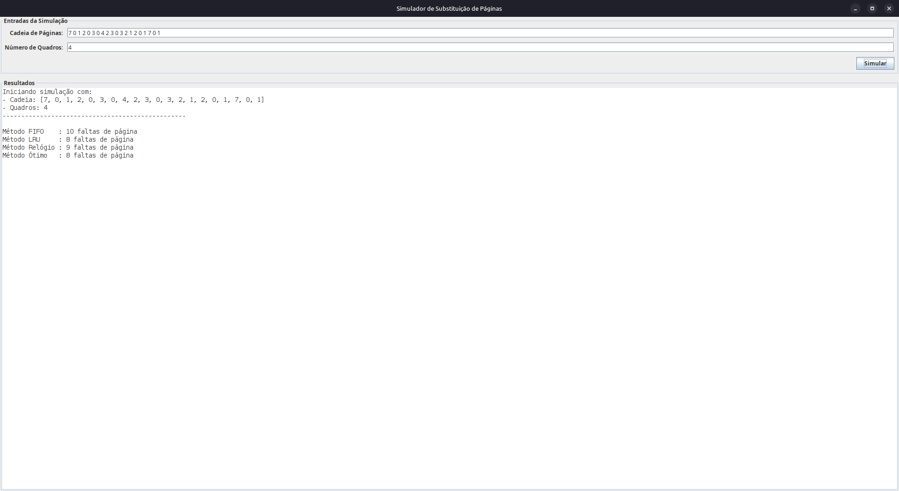

# Simulador de Algoritmos de Substituição de Páginas

Trabalho da disciplina de Projeto de Sistema Operacional, que consiste em um simulador em Java para comparar o desempenho de diferentes algoritmos de substituição de páginas.

O programa possui uma interface gráfica (GUI) em Java Swing para fácil utilização, além de um modo console para execução de testes via terminal.

## Algoritmos Implementados

O simulador implementa e compara 4 dos principais algoritmos de substituição de páginas:

1.  **FIFO (First-In, First-Out)**
2.  **LRU (Least Recently Used)**
3.  **Relógio (Clock / Segunda Chance)**
4.  **Ótimo (Optimal)**

## Como Executar

O projeto pode ser executado de duas formas: através da Interface Gráfica (principal) ou do Modo Console (legado/debug).

### Opção 1: Interface Gráfica (GUI)

**Via IDE (IntelliJ, Eclipse, etc.):**
1.  Clone este repositório.
2.  Abra o projeto na sua IDE.
3.  Localize o arquivo `src/SimuladorGUI.java`.
4.  Execute o método `main()` contido neste arquivo.

#### Utilização da GUI

1.  Preencha o campo **"Cadeia de Páginas"** com os números separados por espaço (ex: `7 0 1 2 0 3 0 4`).
2.  Preencha o campo **"Número de Quadros"** (ex: `4`).
3.  Clique no botão **"Simular"**.
4.  Os resultados finais comparativos aparecerão na área de "Resultados" da janela.
5.  O log detalhado (passo a passo) de cada algoritmo será impresso no terminal/console de onde o `SimuladorGUI` foi executado (como solicitado por você).

---

### Opção 2: Modo Console (Legado/Debug)

Este modo executa a lógica diretamente no terminal, sem a interface gráfica.

**Via IDE:**
1.  Localize o arquivo `src/SimuladorPaginas.java`.
2.  Execute o método `main()` contido neste arquivo.

#### Utilização do Console

O programa fará duas perguntas:

1.  **Digite a cadeia de referência de páginas:**
    * *Exemplo:* `7 0 1 2 0 3 0 4 2 3 0 3 2 1 2 0 1 7 0 1`
2.  **Digite o número de quadros (frames) de memória:**
    * *Exemplo:* `4`

O programa exibirá o passo a passo e o resumo comparativo diretamente no terminal.

## Autores

* Autor 1: João Pedro Cavalcante Araripe e Lima
* Autor 2: Marcus Vinícius Herbster-Ferreira
